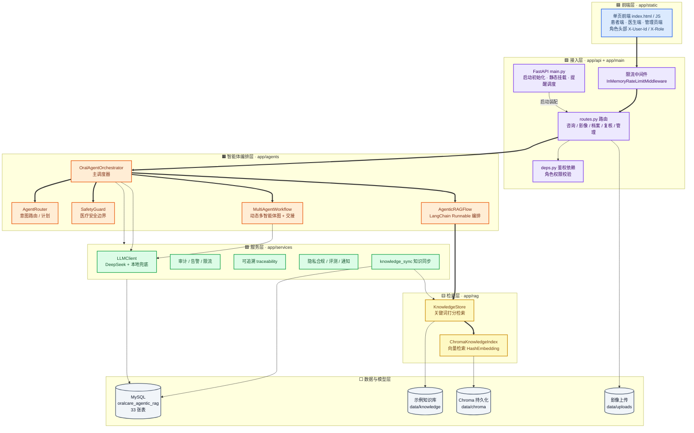
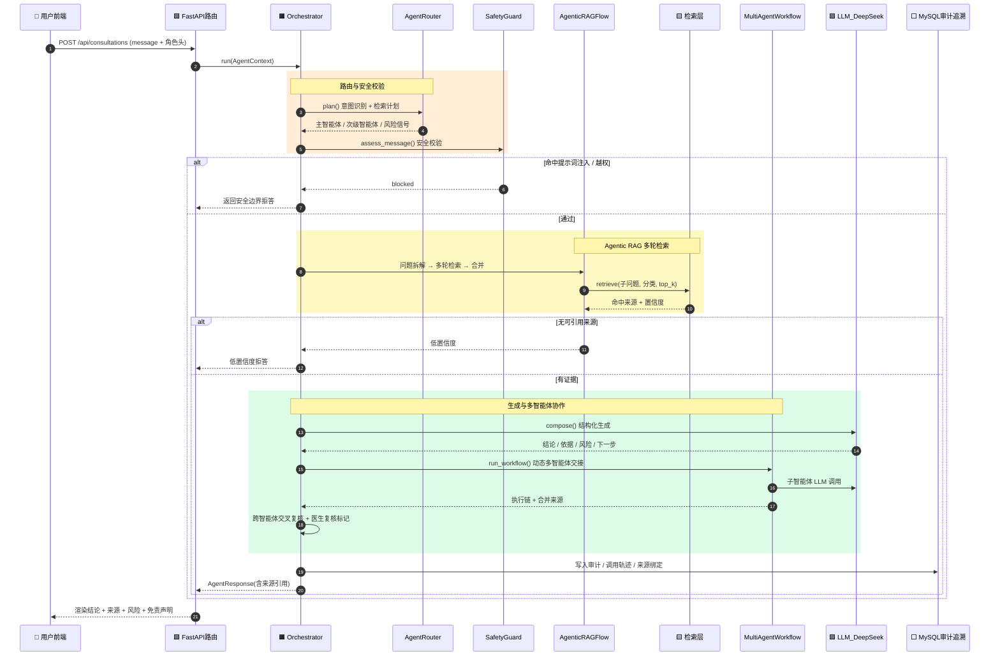
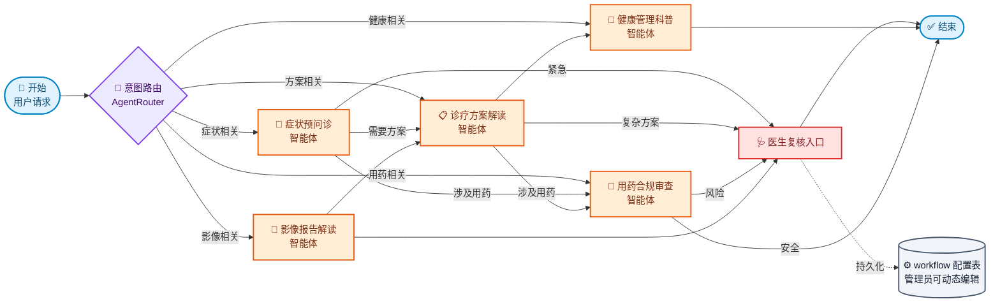
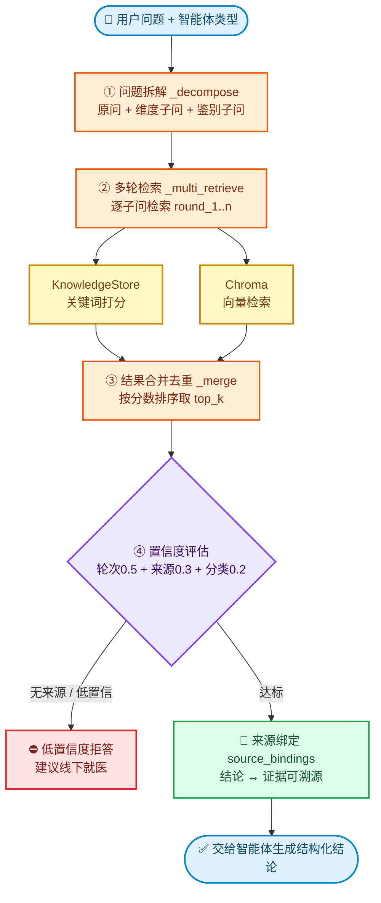

# 项目架构图（逐字稿配套讲解版）

> 配套《项目讲解逐字稿.md》使用。下列图均为 Mermaid 格式，可在支持 Mermaid 的 Markdown 预览（VS Code、Typora、语雀、GitHub）或 PPT 插件中直接渲染展示。
>
> 系统定位：**基于 Agentic RAG 与多智能体协作的口腔医疗智能服务平台**（FastAPI 后端 + 原生前端 + Chroma 向量检索 + 五智能体调度 + DeepSeek LLM + MySQL 业务库）。
>
> 配色图例：🟦 前端 / 🟪 接入 / 🟧 编排 / 🟩 服务 / 🟨 检索 / ⬜ 数据。

---

## 图 1 · 系统总体分层架构

> 讲解用途：开场一分钟讲清"系统由哪几层组成，请求从上往下怎么流"。

---

## 图 2 · 一次咨询的端到端调用链

> 讲解用途：讲"用户问一句话，系统内部到底发生了什么"，是 demo 主线。

---

## 图 3 · 五智能体调度与协作

> 讲解用途：讲核心卖点"多智能体协作 + 动态 workflow + 医生复核兜底"。

---

## 图 4 · Agentic RAG 检索流程

> 讲解用途：讲"为什么叫 Agentic RAG，而不是一次检索"。

**RAG 要点**
- 编排基于 `LangChain Runnable`：`拆解 → 多轮检索 → 合并` 三段链（[agentic_flow.py](../app/agents/agentic_flow.py)）。
- 每个智能体有专属子问题模板（牙位 / 用药禁忌 / 影像术语 / 疗程 / 护理阶段），实现"按领域多角度召回"。
- 检索同时走关键词打分与 Chroma 向量；**无来源即拒答**，保证不凭空作答，符合医疗安全边界。

---

## 调度要点（图 3 配套讲稿）

- 路由由 `AgentRouter.plan()` 给出主 / 次智能体与风险信号；workflow 按图边 + 智能体交接动作决定下一跳，并带**循环保护**（已执行的智能体不重复进入）。
- 任一智能体标记 `requires_review` 或触发风险 / 紧急，统一汇入**医生复核**节点。
- workflow 图结构可由管理员动态编辑并持久化到 MySQL（`WorkflowConfig / Node / Edge`），服务启动时从库恢复。

---

## 讲解串词建议（30 秒过渡）

1. **图 1** → "整个平台分五层，前端按角色发请求，经限流和鉴权进入智能体编排层，再调检索层和 LLM，最后落到 MySQL。"
2. **图 2** → "用户问一句牙痛，系统先路由意图、再做安全校验，然后 Agentic RAG 多轮检索，证据足够才让智能体生成，并写入完整审计轨迹。"
3. **图 3** → "五个智能体不是孤立的，它们按 workflow 图协作交接，任何风险都兜底到医生复核，且这张图管理员可以动态改。"
4. **图 4** → "我们的检索不是一次 query，而是拆成多个子问题多轮召回再合并，低置信度直接拒答——这是医疗场景的安全底线。"
